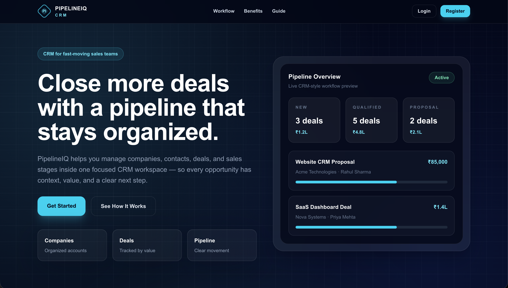
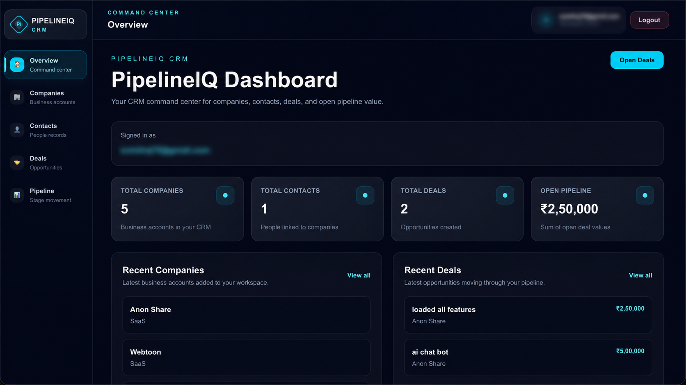
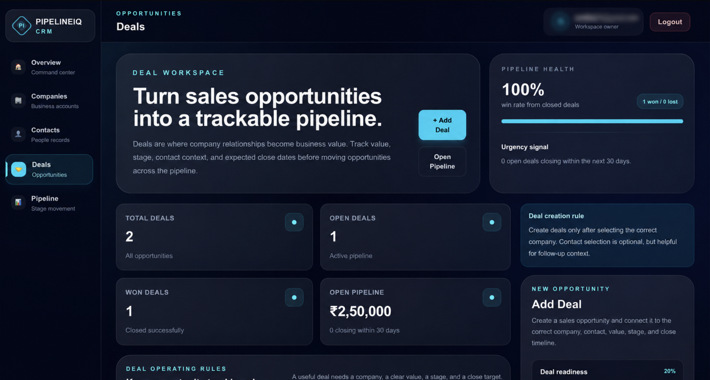
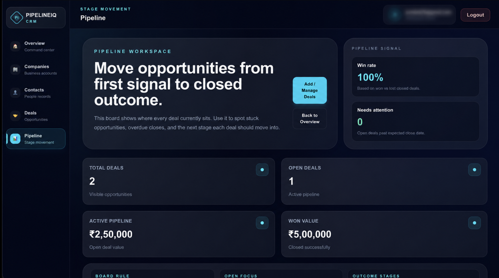

# PipelineIQ

PipelineIQ is a multi-user B2B sales CRM built with Next.js, TypeScript, Tailwind CSS, Supabase Auth, Supabase PostgreSQL, and Supabase Row Level Security.

The application helps users manage a complete sales workflow:

Company → Contact → Deal → Pipeline → Dashboard

Each logged-in user gets a private CRM workspace where they can create companies, attach contacts, track deals, move opportunities through pipeline stages, and manage record lifecycle using active, inactive, and archived states.

---

## Live Demo

Production URL: https://pipeline-iq-nine.vercel.app/

GitHub Repository: https://github.com/offparthaaa89/PipelineIQ

---

## Screenshots

### Landing Page



### Dashboard Overview



### Deals Workspace



### Pipeline Board



---

## Features

### Authentication

- User registration
- User login
- User logout
- Protected dashboard routes
- Public landing page
- Logged-in landing navbar state with workspace shortcut

### Dashboard

- CRM overview dashboard
- Total companies count
- Total contacts count
- Total deals count
- Open pipeline value
- Recent companies
- Recent deals
- Quick action shortcuts

### Companies

- Create companies
- View company records
- Search companies
- Track company status
- Mark company as active, inactive, or archived
- Archived companies are hidden from new contact and deal creation

### Contacts

- Create contacts under companies
- View contact records with linked company context
- Search and filter contacts
- Track contact status
- Mark contact as active, inactive, or archived
- Archived contacts are hidden from new deal creation

### Deals

- Create deals linked to companies and optional contacts
- View all deals
- Search, filter, and sort deals
- View deal detail page
- Edit deal information
- Delete deal with confirmation modal
- Track deal stage, status, value, currency, and expected close date

### Pipeline

- Kanban-style pipeline board
- Deal stages:
  - New
  - Qualified
  - Proposal
  - Negotiation
  - Won
  - Lost
- Move deals using dropdown
- Move deals using Previous / Next buttons
- Optimistic UI update with rollback on database failure
- Stage value totals
- Win rate signal
- Overdue deal signal
- Responsive horizontal board layout

### Record Lifecycle

PipelineIQ uses lifecycle states instead of immediately deleting important CRM records.

Supported statuses:

- Active
- Inactive
- Archived

Archived records are preserved for historical context but hidden from new creation forms. This keeps the CRM clean without losing old business data.

---

## Tech Stack

### Frontend

- Next.js App Router
- React
- TypeScript
- Tailwind CSS

### Backend / Database

- Supabase Auth
- Supabase PostgreSQL
- Supabase Row Level Security

### Deployment

- Vercel

### Version Control

- Git
- GitHub

---

## Security Decisions

PipelineIQ is designed as a multi-user CRM, so private workspace separation is important.

Implemented security measures:

- Supabase Authentication for user identity
- Row Level Security enabled on database tables
- User-owned company and contact records using `user_id`
- User-owned deal records using `owner_id`
- Dashboard data fetched only for the authenticated user
- Deal updates scoped using both deal `id` and `owner_id`
- Archived records hidden from new work creation
- Protected dashboard access after logout

---

## Database Structure

### Companies

Stores business account records.

Main fields:

- id
- user_id
- name
- website
- industry
- size
- location
- status
- created_at
- updated_at

### Contacts

Stores people connected to companies.

Main fields:

- id
- user_id
- company_id
- first_name
- last_name
- email
- phone
- job_title
- status
- created_at
- updated_at

### Deals

Stores sales opportunities.

Main fields:

- id
- owner_id
- company_id
- contact_id
- title
- value
- currency
- stage
- status
- expected_close_date
- created_at
- updated_at

---

## Project Context

PipelineIQ was developed as part of a full-stack development trial task provided by Digital Heroes.

The implementation, engineering decisions, UI development, authentication flow, database relationships, dashboard experience, and deployment setup were completed by Parth.

This project was built as an independent trial-task submission and is not an official Digital Heroes product.

---

## Local Setup

### 1. Clone the repository

```bash
git clone https://github.com/offparthaaa89/PipelineIQ.git
cd PipelineIQ